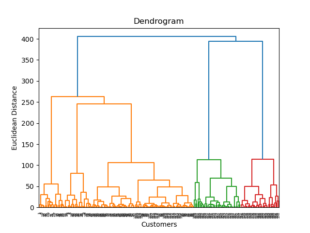
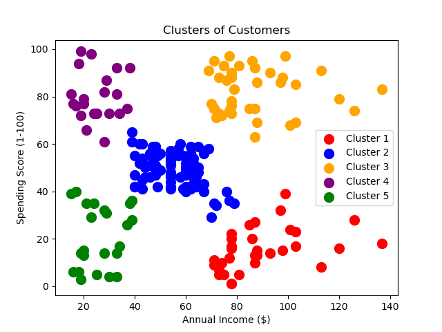

---

# Mall Customer Segmentation using Hierarchical Clustering

## Overview
This repository presents a machine learning project that uses Agglomerative Hierarchical Clustering to segment customers based on their annual income and spending scores. The project aims to identify distinct groups within mall customers for targeted marketing and business strategy development.

## Dataset
The dataset, `Mall_Customers.csv`, includes key features:
- Annual Income of customers
- Spending Scores assigned to customers based on their behavior

## Methodology

### Feature Selection
- Chosen features for clustering are 'Annual Income' and 'Spending Score'.

### Dendrogram Creation
- Constructed a dendrogram to determine the optimal number of clusters using the Ward method.
- The dendrogram visualizes how individual customers are grouped together in clusters.

### Hierarchical Clustering
- Implemented Agglomerative Hierarchical Clustering with an optimal number of clusters determined from the dendrogram.

### Visualization
- Visualized the resulting customer segments to understand the distribution of customers in different clusters.

## Results

### Dendrogram
- Dendrogram
- The dendrogram graph assists in determining the optimal number of clusters by illustrating the hierarchical clustering process.

### Cluster Visualization
- Clusters of Customers
- This plot shows the different clusters formed, represented in various colors, indicating distinct customer segments based on their annual income and spending scores.

## Usage
1. Clone the repository.
2. Run the provided script to perform the hierarchical clustering.
3. The script will output the dendrogram and a scatter plot of the clusters.

## Requirements
- Python 3.x
- Libraries: pandas, numpy, matplotlib, scikit-learn

## Contributing
Contributions are welcome. Feel free to fork this repository, add your changes, and submit a pull request.

---
