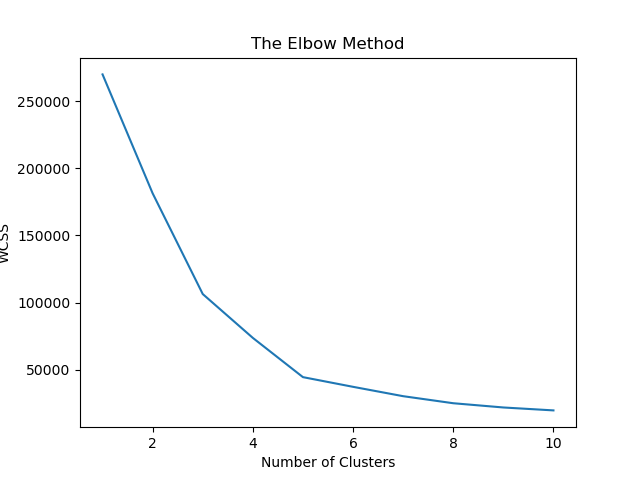
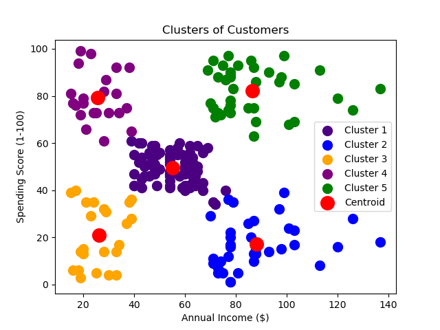

---

# Mall Customer Segmentation using K-Means Clustering

## Overview
This repository contains a machine learning project that utilizes the K-Means clustering algorithm to segment customers of a mall based on their annual income and spending score. The goal is to identify distinct groups of mall customers for targeted marketing strategies.

## Dataset
The dataset used, named `Mall_Customers.csv`, includes customers' information such as their annual income and spending score. 

## Methodology

### Feature Selection
- Selected features for clustering are 'Annual Income' and 'Spending Score'.

### Determining Optimal Number of Clusters
- Applied the Elbow Method to determine the optimal number of clusters.
- Plotted Within-Cluster Sum of Squares (WCSS) against the number of clusters.

### K-Means Clustering
- Implemented K-Means clustering with the optimal number of clusters determined from the Elbow Method.

### Visualization
- Visualized the customer segments using scatter plots to show the clusters of customers.

## Results

### Elbow Method Graph
- Elbow Method Graph
- The Elbow Method graph helps to visualize the optimal number of clusters by showing the point where the WCSS starts to decrease at a slower rate.

### Cluster Visualization
- Clusters of Customers
- This scatter plot displays the distinct clusters formed by the K-Means algorithm, with each cluster representing a different customer segment.

## Usage
1. Clone the repository.
2. Run the provided script to perform customer segmentation.
3. The script will output two graphs, which are also included in the README.

## Requirements
- Python 3.x
- Libraries: pandas, numpy, matplotlib, scikit-learn

## Contributing
Feel free to fork this repository, add your changes, and submit a pull request.

---
